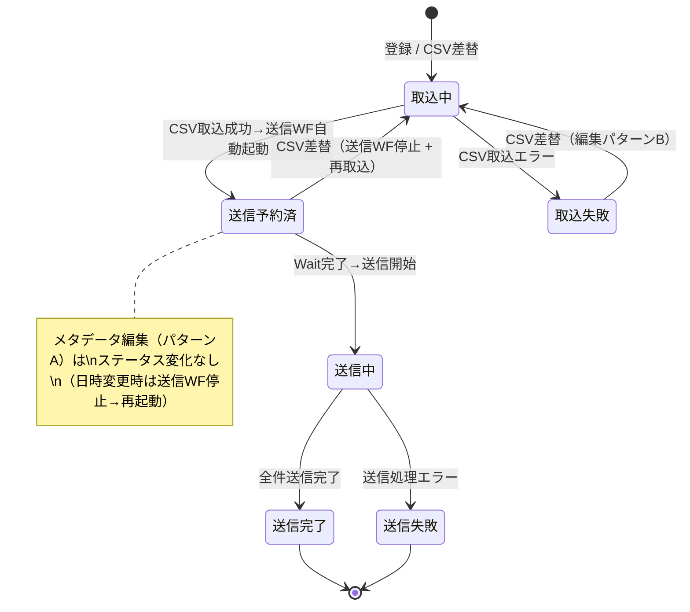
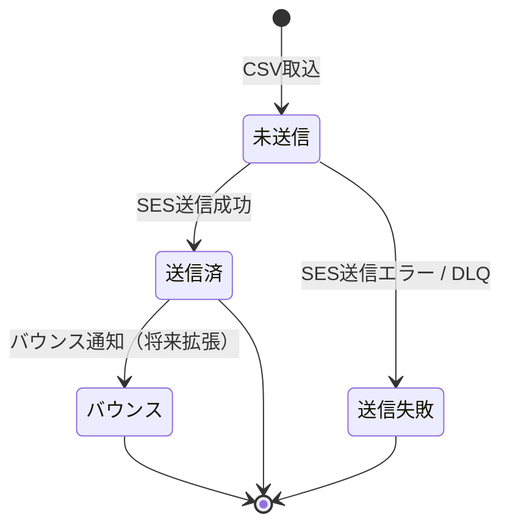
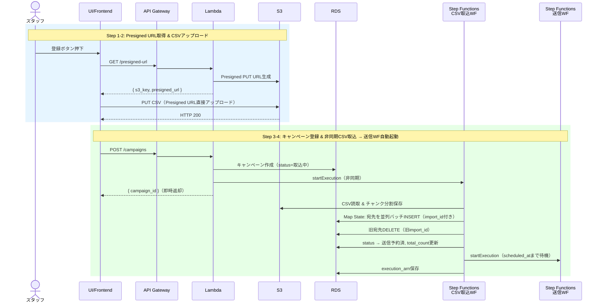
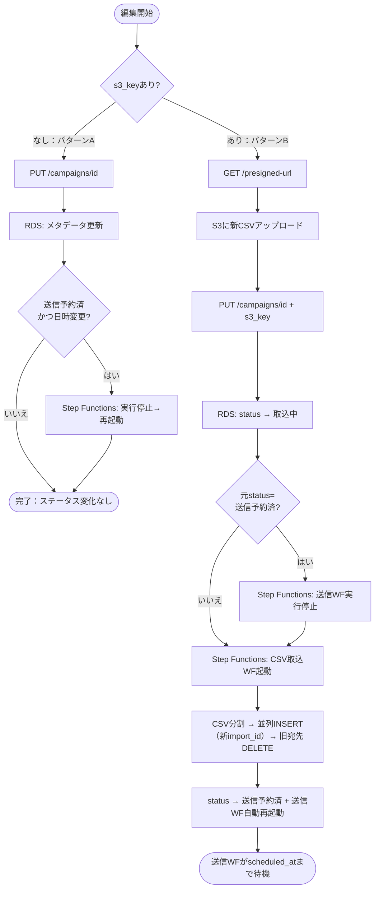
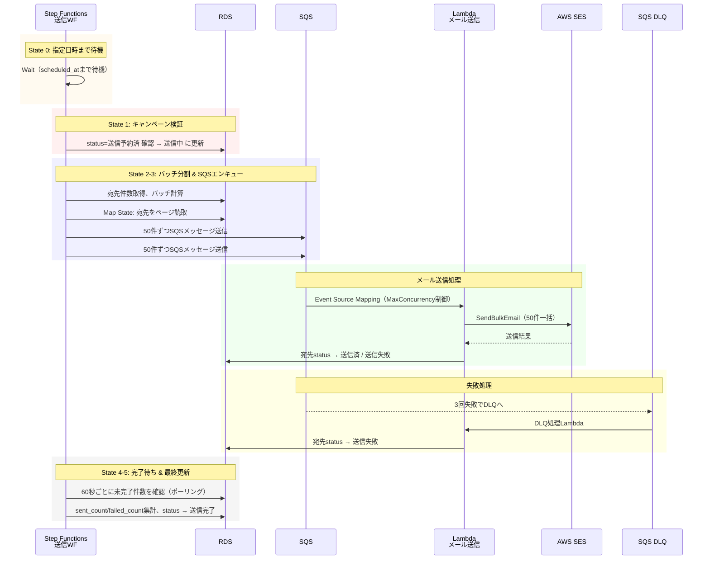

# メール一斉送信システム設計 - 概要

## Context

スタッフがWeb画面からCSVファイル（宛先メールアドレス20万件）をアップロードし、指定日時に一斉メール送信を行うシステムを設計する。AWS SESを利用し、送信結果のステータス管理も行う。将来的にはバウンス管理等の拡張も見据える。

---

## ステータス定義

### キャンペーンステータス（notification_campaigns.status）

| ステータス | 説明 |
|---|---|
| 取込中 | CSV取込処理中（Step Functions 実行中） |
| 取込失敗 | CSV取込処理でエラーが発生 |
| 送信予約済 | 送信ワークフロー待機中（指定日時まで Wait） |
| 送信中 | メール送信処理中 |
| 送信完了 | 全件送信完了 |
| 送信失敗 | 送信処理でエラーが発生 |

### 宛先ステータス（notification_recipients.status）

| ステータス | 説明 |
|---|---|
| 未送信 | 登録済み、未処理 |
| 送信済 | SESで送信完了 |
| 送信失敗 | 送信処理でエラーが発生 |
| バウンス | 送信後にバウンスが発生（将来拡張） |

### キャンペーンステータス遷移図

### 宛先ステータス遷移図

---

## 全体アーキテクチャ

### 登録フロー

### 編集フロー

### 送信フロー

---

## インフラ構成要素

| サービス | 用途 |
|---|---|
| API Gateway | REST API エンドポイント |
| Lambda | 各処理のコンピュート |
| S3 | CSVファイル保存 |
| RDS (MySQL/PostgreSQL) | キャンペーン・宛先データ管理 |
| RDS Proxy | Lambda→RDS接続プーリング（必須） |
| SQS | メール送信キュー + DLQ |
| Step Functions | CSV取込ワークフロー + 送信ワークフロー（2つ） |
| SES | メール送信 |
| CloudWatch | 監視・アラーム |

---

## 関連ドキュメント

| ファイル | 内容 |
|---|---|
| [01-registration-flow.md](./01-registration-flow.md) | 登録フロー詳細 |
| [02-edit-flow.md](./02-edit-flow.md) | 編集フロー詳細 |
| [03-sending-flow.md](./03-sending-flow.md) | 送信フロー詳細 |
| [04-database-design.md](./04-database-design.md) | データベース設計 |
| [05-ses-configuration.md](./05-ses-configuration.md) | SES設定・レート制御 |
| [06-cost-and-testing.md](./06-cost-and-testing.md) | コスト概算・検証方法 |
| [rds-proxy.md](./rds-proxy.md) | RDS Proxy 利用背景と導入手順 |
