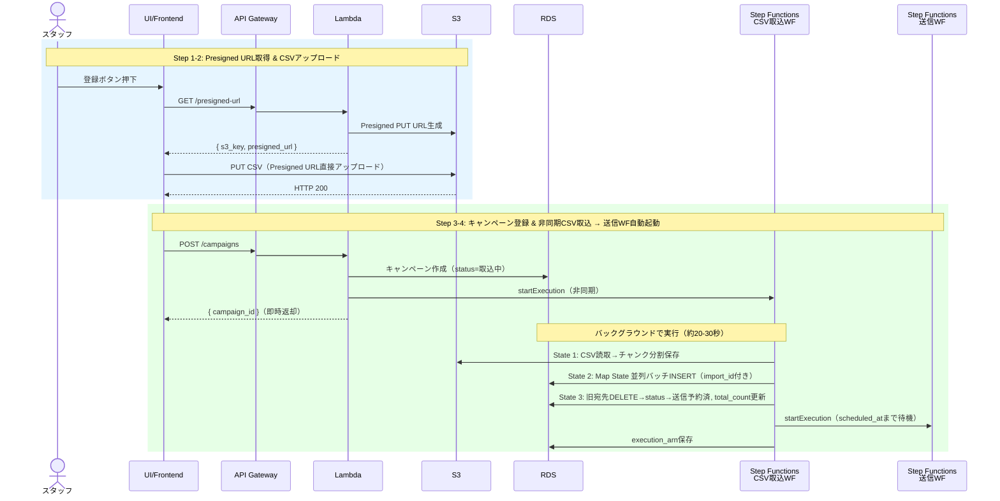
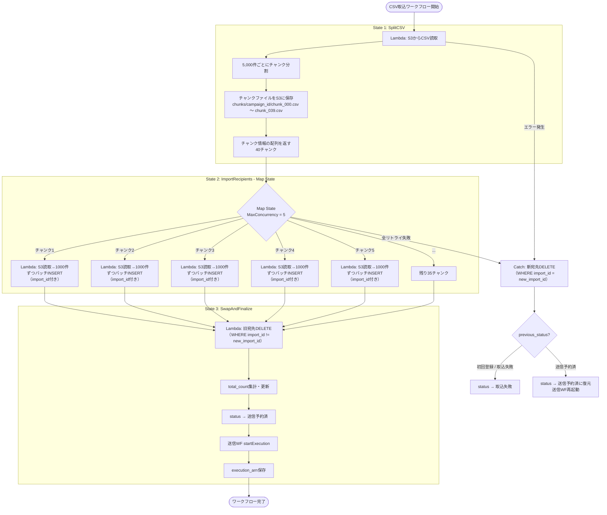

# 登録フロー

## 概要

スタッフが登録ボタンを押下すると、以下の Step 1〜3 が順番に実行され、
その後 Step 4（非同期CSV取込 → 送信WF自動起動）で完了する。

### 全体フロー

---

## Step 1: Presigned URL 取得

**なぜ Presigned URL を使うのか:**
API Gateway のペイロード上限は REST API で 10MB。20万件のメールアドレスCSV（約6MB〜）は
上限に近く、付随データがあれば超過する。S3 Presigned URL でフロントから S3 に直接アップロード
することで、API Gateway のサイズ制限を完全に回避する。

1. `GET /presigned-url` → API Gateway → Lambda
   - S3 の Presigned PUT URL を生成（有効期限: 15分）
   - レスポンス: `{ s3_key, presigned_url }`
   - s3_key はUUID等でユニークに生成: `uploads/{uuid}.csv`

---

## Step 2: CSV を S3 に直接アップロード

2. フロントエンドが Presigned URL を使って S3 に CSV を PUT
   - API Gateway を経由しないため、ファイルサイズの制約なし（S3上限: 5GB）
   - Content-Type: `text/csv` を指定
   - S3 のレスポンス（HTTP 200）でフロント側はアップロード完了を検知

---

## Step 3: キャンペーン登録API呼び出し

3. CSVアップロード完了後、`POST /campaigns` を呼び出し
   - リクエストボディ: `{ subject, body_html, body_text, from_address, scheduled_at, s3_key }`
   - Lambda 内部処理:
     1. RDS: `notification_campaigns` レコード作成（status = `取込中`）
     2. Step Functions: CSV取込ワークフローを非同期起動（`startExecution`）
        - 入力: `{ campaign_id, s3_key }`
     3. **即時レスポンス返却**: `{ campaign_id }` — フロントはここで登録完了を表示
   - ポイント: 宛先登録は Step Functions に任せ、API 自体は即座に返る

---

## Step 4: 非同期 CSV取込 & 宛先一括登録（Step Functions）

キャンペーン登録 Lambda が起動した Step Functions ワークフローが宛先登録を行う。
20万件を1つの Lambda で逐次処理するのではなく、CSV をチャンク分割し Map State で
並列に RDS へ INSERT することで、高速かつ Lambda タイムアウトのリスクなく処理する。

### CSV取込ワークフロー

### 処理時間の見積もり（並列処理）

| State | 処理 | 所要時間 |
|---|---|---|
| State 1 | CSV分割（S3読取 + 40チャンク書込） | 約5-10秒 |
| State 2 | Map State 並列INSERT（8ラウンド × 約2秒） | 約16秒 |
| State 3 | 旧宛先DELETE + ステータス更新 + 送信WF起動 | 約2-5秒 |
| **合計** | | **約20-30秒** |

### 失敗時のリカバリ（import_id によるスワップ方式）

CSV取込WFの入力に `import_id`（UUID）と `previous_status` を含め、失敗時の安全なロールバックを実現する。

- WF入力: `{ campaign_id, s3_key, import_id, previous_status }`
- Step Functions の各 State に Catch を設定
- エラー発生時 → Lambda（エラー処理）:
  1. `DELETE FROM notification_recipients WHERE campaign_id = ? AND import_id = ?`（新import_idの宛先のみ物理削除）
  2. ステータス復元（`previous_status` に応じて分岐）:
     - 初回登録 / 取込失敗 → `status` → `取込失敗`
     - 送信予約済（CSV差し替え時） → `status` → `送信予約済` に復元 + 送信WF再起動
  3. CloudWatch にエラーログを出力

**なぜ import_id が必要か:**
- Map State は並列処理のためDBトランザクションで一括ロールバックできない
- `import_id` で新旧の宛先を区別することで、失敗時に**新しい宛先のみ削除し、旧宛先を保持**できる
- CSV差し替え時に取込失敗しても、旧宛先データが残っているため元の状態に復元可能

| シナリオ | 失敗時の挙動 |
|---|---|
| 初回登録で失敗 | 新宛先DELETE → status=取込失敗 |
| CSV差し替えで失敗 | 新宛先DELETE → 旧宛先は残る → status=送信予約済に復元 → 送信WF再起動 |

- Map State 内の個別チャンク失敗:
  - Retry ポリシー: MaxAttempts = 2, BackoffRate = 2.0 で自動リトライ
  - 全リトライ失敗後は Catch でエラー処理へ遷移
- UI 側でステータスを表示し、失敗時はスタッフに再操作を促す

### 送信WFの自動起動

CSV取込WFの State 3（FinalizeImport）で以下を実行:

1. `total_count` を集計して `notification_campaigns` を更新
2. `status` → `送信予約済` に更新
3. Step Functions（送信ワークフロー）を `startExecution` で起動
   - 入力: `{ campaign_id, scheduled_at }`
   - ワークフローは Wait 状態で `scheduled_at` まで待機し、その後送信処理を開始
4. `execution_arn` を RDS に保存（編集時の停止・再起動に使用）

※ スタッフによる確認ステップは不要。`scheduled_at` は登録時に既に指定されているため、CSV取込完了後に自動で送信予約に移行する。
