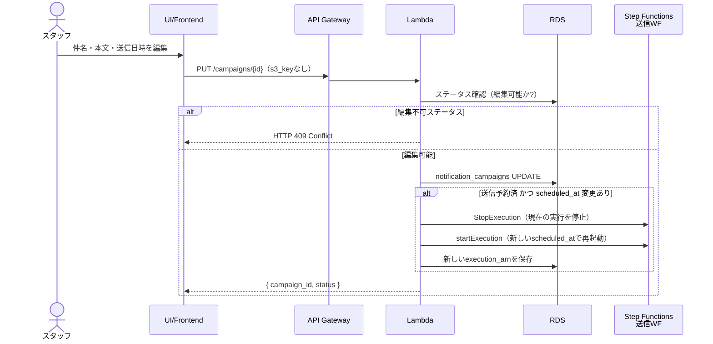
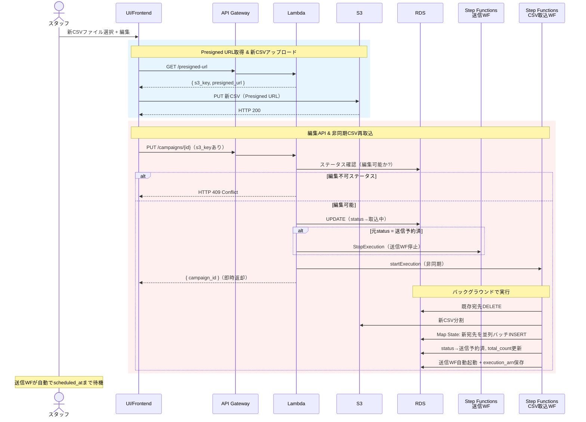
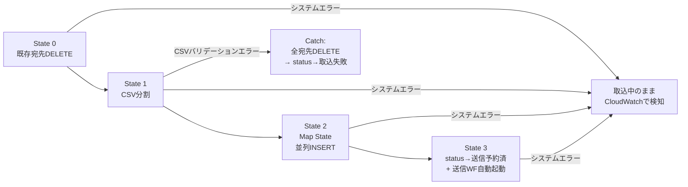
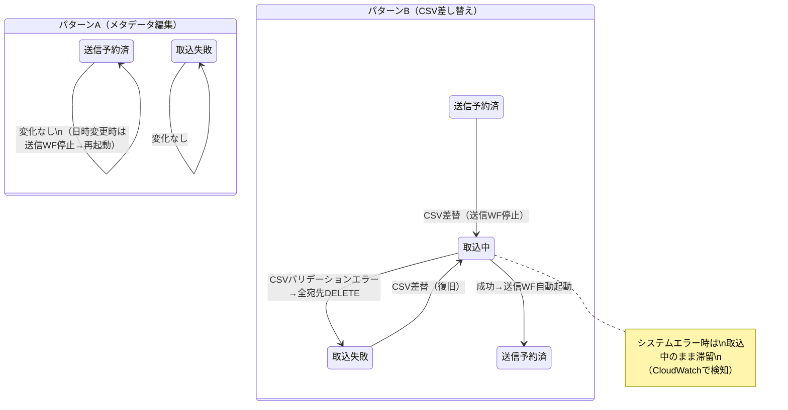

# 編集フロー

## 概要

送信前のステータスであれば、メール件名・本文・送信日時・宛先CSVを変更できる。
編集には2つのパターンがある。

- **パターンA**: メタデータのみ編集（件名・本文・送信日時）
- **パターンB**: 宛先CSV差し替え（メタデータ編集も同時に可能）

---

## 編集可能なステータス

| 現在のステータス | メタデータ編集 | CSV差し替え | 備考 |
|---|---|---|---|
| 送信予約済 | 可 | 可 | 送信WF待機中（Wait状態）のため編集可能 |
| 取込失敗 | 可 | 可 | CSV再アップロードで復旧可能 |
| 取込中 | **不可** | **不可** | CSV取込中のため排他制御 |
| 送信中 | **不可** | **不可** | 送信処理中 |
| 送信完了 | **不可** | **不可** | 送信完了済み |
| 送信失敗 | **不可** | **不可** | 送信失敗済み |

---

## パターンA: メタデータのみ編集

件名・本文・送信日時のみを変更する場合。宛先は変わらない。

### フロー

**API**: `PUT /campaigns/{id}`（`s3_key` なし）

- リクエストボディ: `{ subject?, body_html?, body_text?, from_address?, scheduled_at? }`
- ステータスは変化しない
- `送信予約済` かつ `scheduled_at` 変更時: Wait 中の送信WFを停止し、新しい日時で再起動
- メタデータのみの変更（日時変更なし）: 送信WFは Wait 継続（送信開始時にRDSから最新データを読む）
- 宛先の再取込は不要

---

## パターンB: 宛先CSV差し替え

宛先を変更する場合。既存宛先を全削除してから新CSVを取込む。
メタデータの同時編集も可能。

### フロー

**API**: `PUT /campaigns/{id}`（`s3_key` あり）

- リクエストボディ: `{ subject?, body_html?, ..., s3_key }` — **s3_key の有無で分岐**
- CSV取込WF完了後、自動で status → `送信予約済` に戻り、送信WFが再起動される
- 元の `scheduled_at` で送信WFが Wait 状態に入る

### 失敗時のリカバリ（エラー種別による分岐）

| エラー種別 | エラー処理 | ステータス |
|---|---|---|
| 人為的エラー（CSV不正） | 全宛先DELETE → status → `取込失敗` | スタッフがCSVを修正して再アップロード |
| システムエラー（AWS障害等） | ステータス更新なし → `取込中` のまま | 運用チームが CloudWatch で検知・対処 |

※ 既存宛先は State 0 で先に削除されるため、どちらのケースでも旧データは残らない

### CSV取込ワークフロー（登録フローと共通）

---

## ステータス遷移（編集時）

---

## 排他制御

- `取込中` に編集APIが呼ばれた場合は **HTTP 409 Conflict** を返す
- Step Functions 実行中に重複起動を防ぐため、execution name に `campaign_id` を含めて冪等性を確保
- フロントは `取込中` の間は編集ボタンを非活性にする
