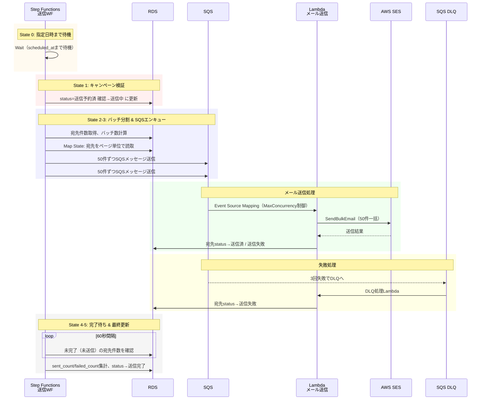
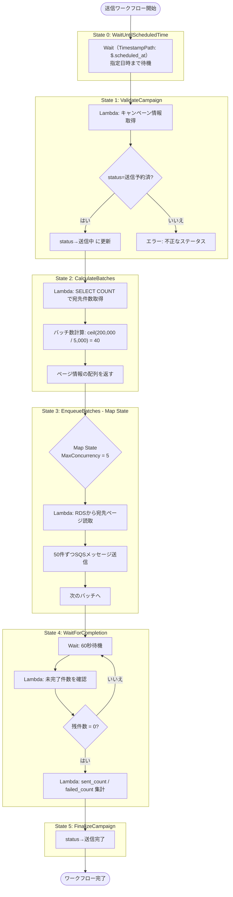
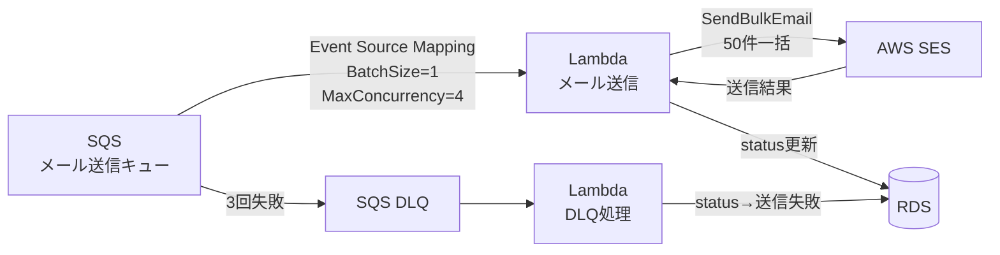

# 送信フロー

## 概要

CSV取込完了時に Step Functions（送信ワークフロー）が自動起動し、Wait 状態で指定日時まで待機する。
指定日時到達後、宛先を SQS にエンキュー → Lambda が SES でメール送信 → 完了後にステータス更新を行う。

### 全体フロー



---

## 送信ワークフロー（Step Functions）



---

## メール送信処理（SQS → Lambda → SES）



### SQSメッセージ形式

```json
{
  "campaign_id": "xxx",
  "subject": "...",
  "body_html": "...",
  "body_text": "...",
  "from_address": "...",
  "recipients": [
    {"id": 1, "email": "a@example.com"},
    {"id": 2, "email": "b@example.com"}
  ]
}
```

※ 1メッセージあたり最大50件の宛先を含む

### Lambda処理

1. SES SendBulkEmail API を呼び出し（50件一括）
2. レスポンスから各宛先の送信結果を確認
3. RDSに送信ステータスを一括UPDATE
   - 成功: status = 送信済, sent_at = now
   - 失敗: status = 送信失敗, error_message = ...

---

## 失敗処理（DLQ）

| 設定 | 値 |
|---|---|
| maxReceiveCount | 3（3回失敗でDLQへ） |
| visibilityTimeout | 120秒 |

DLQ Lambda の処理:
- メッセージ内の宛先IDを抽出
- RDS: 該当宛先のステータスを `送信失敗` に更新
- CloudWatch: アラーム発火（失敗件数閾値）
