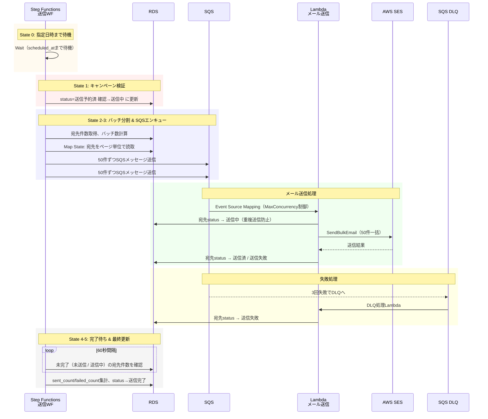
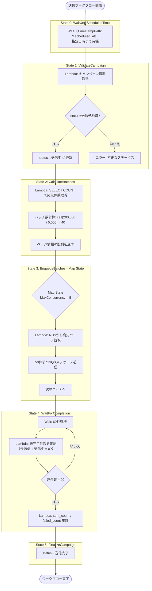
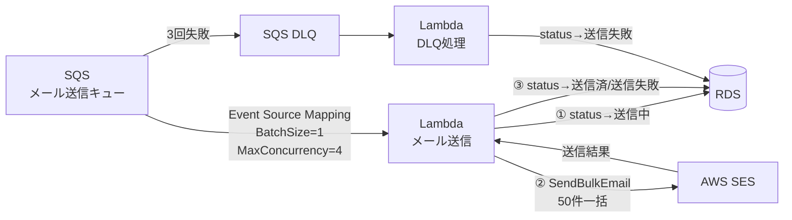

# 送信フロー

## 概要

CSV取込完了時に Step Functions（送信ワークフロー）が自動起動し、Wait 状態で指定日時まで待機する。
指定日時到達後、宛先を SQS にエンキュー → Lambda が SES でメール送信 → 完了後にステータス更新を行う。

### 全体フロー



---

## 送信ワークフロー（Step Functions）



---

## メール送信処理（SQS → Lambda → SES）



### SQSメッセージ形式

```json
{
  "campaign_id": "xxx",
  "subject": "...",
  "body_html": "...",
  "body_text": "...",
  "from_address": "...",
  "recipients": [
    {"id": 1, "email": "a@example.com"},
    {"id": 2, "email": "b@example.com"}
  ]
}
```

※ 1メッセージあたり最大50件の宛先を含む

### Lambda処理（RDS更新先行方式 — 重複送信防止）

1. RDS: 対象宛先のステータスを `未送信` → `送信中` に一括UPDATE（重複送信防止）
2. SES SendBulkEmail API を呼び出し（50件一括）
3. レスポンスから各宛先の送信結果を確認
4. RDSに送信ステータスを一括UPDATE
   - 成功: status = 送信済, sent_at = now
   - 失敗: status = 送信失敗, error_message = ...

**重複送信防止の仕組み**:
- SES呼び出し前にステータスを `送信中` にすることで、Lambda がクラッシュして SQS メッセージがリトライされても、`送信中` の宛先はスキップされる
- ステップ1の直後にクラッシュした場合、メールは未送信だが `送信中` のまま残る（重複送信よりも未送信の方が影響が軽い）

### SES送信結果の判定方法

SendBulkEmail API の送信結果は、**同期レスポンス**と**非同期イベント通知**の2段階で判定される。現在の設計では同期レスポンスのみを使用し、非同期イベント通知は提案2（バウンス・苦情処理）で対応予定。

#### 第1段階: 同期レスポンス（API 呼び出し直後）

SendBulkEmail API を呼び出すと、宛先ごとに `BulkEmailEntryResult` が返る。`SUCCESS` は「SES が配信を受け付けた」意味であり、「受信者に届いた」ではない。

参考: [SendBulkEmail API リファレンス](https://docs.aws.amazon.com/ses/latest/APIReference-V2/API_SendBulkEmail.html) / [BulkEmailEntryResult](https://docs.aws.amazon.com/ses/latest/APIReference-V2/API_BulkEmailEntryResult.html)

**BulkEmailEntryResult の Status 値一覧:**

| Status | 意味 |
|---|---|
| `SUCCESS` | SES が受け付けた（配信を試行する） |
| `MESSAGE_REJECTED` | ウイルス検知等で拒否 |
| `MAIL_FROM_DOMAIN_NOT_VERIFIED` | 送信元ドメインが未認証 |
| `CONFIGURATION_SET_DOES_NOT_EXIST` | 設定セットが存在しない |
| `TEMPLATE_DOES_NOT_EXIST` | テンプレートが存在しない |
| `ACCOUNT_SUSPENDED` | アカウント停止中 |
| `ACCOUNT_THROTTLED` | レート上限超過 |
| `ACCOUNT_DAILY_QUOTA_EXCEEDED` | 日次送信クォータ超過 |
| `INVALID_SENDING_POOL_NAME` | 送信プール名が不正 |
| `ACCOUNT_SENDING_PAUSED` | アカウントの送信が一時停止中 |
| `CONFIGURATION_SET_SENDING_PAUSED` | 設定セットの送信が一時停止中 |
| `INVALID_PARAMETER` | パラメータ不正 |
| `TRANSIENT_FAILURE` | 一時的な失敗 |
| `FAILED` | その他の失敗 |

**判定パターン:**

**パターン1: API 自体が例外（50件全て失敗）**

SES がリクエスト自体を拒否した場合。Lambda の try-catch で捕捉される。

→ Lambda がエラー終了 → SQS リトライ → 3回失敗で DLQ へ

**パターン2: API 成功、レスポンス内に個別エラーあり（一部失敗）**

API 呼び出しは成功（HTTP 200）だが、レスポンスに宛先ごとの結果が含まれる。

```json
{
  "BulkEmailEntryResults": [
    { "Status": "SUCCESS", "MessageId": "xxx" },
    { "Status": "MESSAGE_REJECTED", "Error": "..." },
    { "Status": "SUCCESS", "MessageId": "yyy" }
  ]
}
```

Lambda がレスポンスを解析し、宛先ごとにステータスを振り分ける。

- `SUCCESS` → 宛先status = `送信済`（SES が配信受付済み）
- それ以外 → 宛先status = `送信失敗`（error_message に Status 値を記録）

**パターン3: 全件 SUCCESS**

全宛先が SES に受け付けられ、全て `送信済` になる。

#### 第2段階: 非同期イベント通知（配信試行後 — 数秒〜数分後）

SES が実際に配信を試行した後、結果が非同期でイベント通知される。API の同期レスポンスでは返らない。

参考: [イベント通知のセットアップ](https://docs.aws.amazon.com/ses/latest/dg/monitor-sending-activity-using-notifications.html) / [SNS通知の内容](https://docs.aws.amazon.com/ses/latest/dg/notification-contents.html) / [イベントデータの例](https://docs.aws.amazon.com/ses/latest/dg/event-publishing-retrieving-sns-examples.html)

```
SES 送信キュー → 配信試行 → 結果に応じてイベント発生（非同期）
                                │
                    ┌─ Send（送信試行した）
                    ├─ Delivery（宛先サーバーが受理した）
                    ├─ Bounce（宛先サーバーが拒否した）
                    │    ├─ Permanent（ハードバウンス: アドレス不存在等）
                    │    └─ Transient（ソフトバウンス: メールボックス満杯等）
                    ├─ Complaint（受信者がスパム報告した）
                    ├─ Reject（SES がウイルス検知等で拒否した）
                    ├─ DeliveryDelay（配信遅延）
                    ├─ Open（受信者がメールを開封した）
                    └─ Click（受信者がリンクをクリックした）
```

**通知の受信に必要な構成:**

```
[SES] → [SNS Topic] → [SQS] → [Lambda: Event Handler] → [RDS: ステータス更新]
```

- SNS Topic / SQS / Lambda 等を設定しないとイベントを受け取れない
- 現在の設計では未実装（提案2で対応予定）

#### 同期レスポンスと非同期イベントの関係まとめ

```
Lambda → SES SendBulkEmail
           │
           ├─ 同期レスポンス（即時）
           │    Status = SUCCESS → 宛先status「送信済」（現在の設計で対応済み）
           │    Status ≠ SUCCESS → 宛先status「送信失敗」（現在の設計で対応済み）
           │
           └─ 非同期イベント（数秒〜数分後 — 提案2で対応予定）
                Delivery → 実際に届いた
                Bounce → 届かなかった（宛先status「バウンス」に更新予定）
                Complaint → スパム報告された
```

- 現在の設計: 同期レスポンスの `SUCCESS` = `送信済` として扱う
- `送信済` = 「SES が配信を受け付けた」であり、受信者に届いた保証ではない
- 配信後のバウンス・苦情は提案2（バウンス・苦情処理）の実装により検知可能になる

---

## 失敗処理（DLQ）

| 設定 | 値 |
|---|---|
| maxReceiveCount | 3（3回失敗でDLQへ） |
| visibilityTimeout | 120秒 |

DLQ Lambda の処理:
- メッセージ内の宛先IDを抽出
- RDS: 該当宛先のステータスを `送信失敗` に更新
- CloudWatch: アラーム発火（失敗件数閾値）
