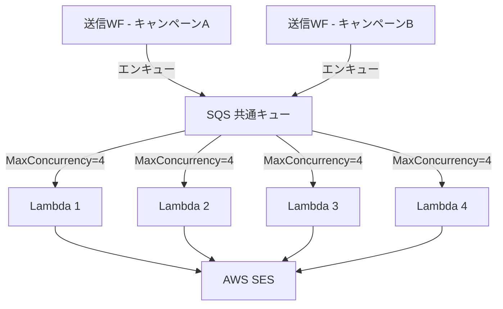
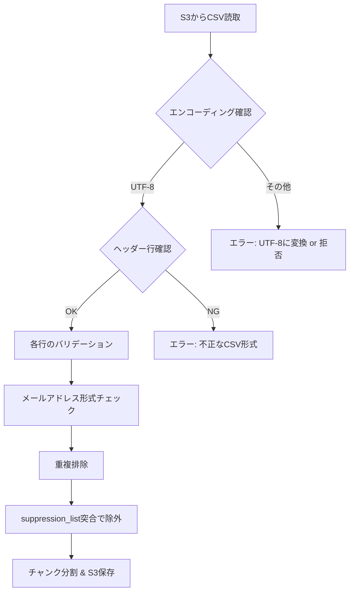
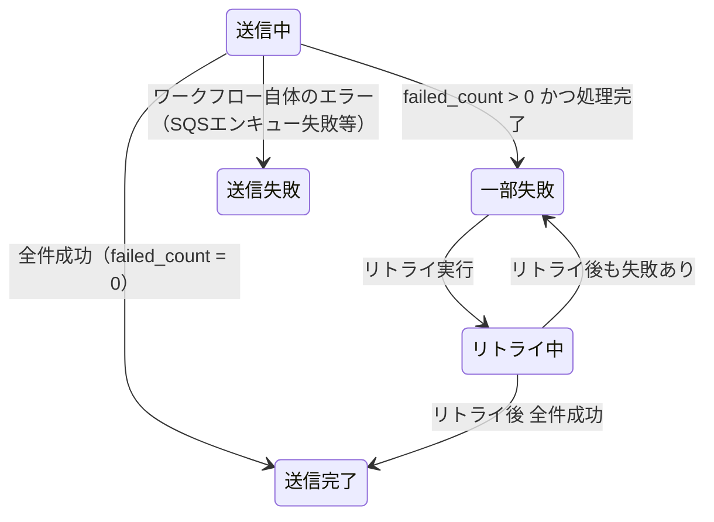

# 設計レビュー・改善提案

## 前提（ヒアリング結果）

| 項目 | 回答 |
|---|---|
| 同時キャンペーン実行 | あり。SESレート上限を超えない工夫が必要 |
| パーソナライゼーション | 不要 |
| キャンペーンキャンセル | 管理画面の詳細画面から削除ボタンで対応済み |
| テナント構成 | 未定 |
| キャンペーン頻度 | 月1〜2回程度（会員への設定変更通知等） |
| データ保持 | 肥大化の認識あり。ガベージ処理は今回スコープ外 |
| スタッフ認証基盤 | 構築済み |
| データベース | PostgreSQL |
| 送信失敗リカバリ | 未検討（提案を希望） |
| HTML本文サイズ | 未検討 |

---

## 1. 複数キャンペーン同時送信時のSESレート制御（重要度: 高）

### 現状の問題

現在の設計では、SQS → Lambda の `MaximumConcurrency = 4` でレート制御をしている。
しかしこれはキャンペーン単位の制御であり、複数キャンペーンが同時に送信中になると
**キャンペーン数 × 4 Lambda** が並列実行され、SESレート上限を超える。

```
例: 2キャンペーンが同時送信中
  キャンペーンA: MaxConcurrency=4 → 200通/秒
  キャンペーンB: MaxConcurrency=4 → 200通/秒
  合計: 400通/秒 → SES上限 200通/秒を超過 → スロットリング発生
```

### 提案: SQSキューの共有化

キャンペーンごとに個別のSQSキューを持つのではなく、**全キャンペーン共通の単一SQSキュー**を使う。

```
【現在の設計（推測）】
  キャンペーンA → SQS-A → Lambda (MaxConcurrency=4)
  キャンペーンB → SQS-B → Lambda (MaxConcurrency=4)
  → 合計8並列、SES上限を超過するリスク

【改善案: 共通キュー方式】
  キャンペーンA ──┐
                  ├→ SQS（共通キュー） → Lambda (MaxConcurrency=4)
  キャンペーンB ──┘
  → 常に最大4並列、SES上限内に収まる
```

**メリット**:
- キャンペーン数に関係なく、SESレート上限を超えないことがアーキテクチャレベルで保証される
- MaxConcurrencyの調整が1箇所で済む
- キャンペーン追加時にSQSキューを新規作成する必要がない

**注意点**:
- 複数キャンペーンが同時送信する場合、後から投入されたキャンペーンの完了時間が延びる
- キャンペーンAの送信中にキャンペーンBがエンキューされると、SQSのFIFO順序で混在する
  - ただしメール送信においてはキャンペーン間の順序保証は不要なので、Standard Queue で問題ない

### 送信ワークフロー側の変更



各Lambdaはメッセージ内の `campaign_id` を見て、対応するキャンペーンのメールを送信する。
キャンペーン情報（subject, body等）はRDSから取得しLambda内でキャッシュする（提案4と関連）。

---

## 2. バウンス・苦情処理の初期リリースへの格上げ（重要度: 高）

### なぜ初期リリースで必要か

SESは送信元アカウントのレピュテーションを以下の基準で管理している:

| 指標 | 閾値 | 超過時のペナルティ |
|---|---|---|
| バウンス率 | 5% | アカウントレビュー → 送信一時停止 |
| 苦情率 | 0.1% | アカウントレビュー → 送信一時停止 |

20万件の一斉送信で1%（2,000件）がバウンスしただけで閾値に近づく。
バウンス管理なしに2回目の送信で同じ無効アドレスに送ると、累積バウンス率がさらに悪化する。

### 最低限必要な初期実装

```
[SES] → [SNS Topic] → [SQS] → [Lambda: Bounce Handler]
                                       │
                                       ▼
                                 [RDS: notification_recipients]
                                 - status → バウンス
                                 - bounce_type (Hard/Soft) 記録

                                 [RDS: suppression_list テーブル（新設）]
                                 - Hard Bounce のアドレスを登録
```

**suppression_list テーブル**:

| カラム名 | 型 | 説明 |
|---|---|---|
| id | BIGINT (PK) | レコードID |
| email_address | VARCHAR(255) UNIQUE | 抑制対象アドレス |
| reason | VARCHAR(20) | hard_bounce / complaint |
| created_at | TIMESTAMP | 登録日時 |

**送信フローへの組み込み**:
- SQSエンキュー前に、suppression_list に含まれるアドレスを除外する
- または、CSV取込時に suppression_list と突合して除外する（こちらの方が効率的）

---

## 3. CSVバリデーションの追加（重要度: 高）

### CSV取込ワークフロー（State 1: SplitCSV）に追加すべき検証



**バリデーション項目**:

| チェック | 処理 |
|---|---|
| エンコーディング | UTF-8 を期待。Shift_JIS 等の場合はエラー or 自動変換 |
| ヘッダー行 | email カラムの存在確認 |
| メールアドレス形式 | 正規表現による基本チェック（@ の存在、ドメイン部分等） |
| 重複排除 | 同一アドレスが複数行ある場合は1件に集約 |
| 空行・不正行 | スキップしてログ出力 |
| suppression_list | Hard Bounceアドレスを除外（提案2と連携） |

**バリデーション結果の通知**:
- `notification_campaigns` に以下カラム追加を検討:
  - `valid_count`: バリデーション通過件数
  - `skipped_count`: スキップ件数（重複・不正・抑制）
- スタッフがスケジュール確定前に「除外された件数」を確認できるようにする

---

## 4. SQSメッセージからメール本文を分離（重要度: 中）

### 現状の問題

現在のSQSメッセージに `subject`, `body_html`, `body_text` を含めている。
SQSのメッセージサイズ上限は **256KB**。HTMLメール本文が大きい場合に上限に達するリスクがある。

また、50件の宛先 × 同じ本文が全SQSメッセージに繰り返し含まれるのは帯域の無駄でもある。
20万件 ÷ 50件 = 4,000メッセージ × 本文サイズ分のデータが重複する。

### 改善案

```json
// 変更前（現在）
{
  "campaign_id": "xxx",
  "subject": "...",
  "body_html": "...(大きい可能性)...",
  "body_text": "...",
  "from_address": "...",
  "recipients": [...]
}

// 変更後
{
  "campaign_id": "xxx",
  "recipients": [
    {"id": 1, "email": "a@example.com"},
    {"id": 2, "email": "b@example.com"}
  ]
}
```

**Lambda側の処理**:
- 初回実行時に `campaign_id` でRDSからキャンペーン情報を取得
- Lambda実行コンテキスト内でキャッシュ（グローバル変数）
- 同一Lambdaインスタンスが再利用される場合、2回目以降はキャッシュを使用

**効果**:
- SQSメッセージサイズが大幅に削減（宛先情報のみ）
- メッセージサイズ上限の心配が不要になる
- SQSのデータ転送コストも微減

---

## 5. 送信失敗時のリカバリ設計（提案）（重要度: 中）

### 現状の課題

「送信失敗」が終端ステータスとなっており、部分的に成功したケースへの対応が不明。
例: 19万件は送信成功、1万件がSESエラーで失敗 → キャンペーン全体が「送信失敗」？

### 提案: 3段階のリカバリ設計

#### A. ステータスの細分化



**notification_campaigns.status に追加**:

| ステータス | 説明 |
|---|---|
| 一部失敗 | 送信処理完了だが失敗した宛先あり（failed_count > 0） |
| リトライ中 | 失敗分のリトライ処理中 |

#### B. 失敗宛先のリトライAPI

```
POST /campaigns/{id}/retry
```

- `status = 一部失敗` のキャンペーンに対してのみ実行可能
- `notification_recipients` から `status = 送信失敗` の宛先を抽出
- 抽出した宛先をSQSに再エンキュー
- キャンペーン status → `リトライ中`
- 送信WFのポーリング（State 4相当）で完了を検知

#### C. リトライ回数の制限

- キャンペーン単位でリトライ回数を記録（`retry_count` カラム追加）
- 最大リトライ回数（例: 3回）を設け、超過した場合はリトライ不可とする
- 繰り返し失敗するアドレスはsuppression_listに追加を検討

### 業務フローとしての提案

```
1. 送信完了 → 管理画面に「全件成功」と表示
2. 一部失敗 → 管理画面に「○件成功 / ×件失敗」と表示
   → スタッフが「失敗分をリトライ」ボタンを押す
   → リトライ実行
3. リトライ後も失敗 → 失敗アドレス一覧をCSVエクスポートして確認
   → 明らかに無効なアドレスはsuppression_listへ
```

---

## 6. 宛先DELETE→INSERTの安全性（重要度: 中）

### 現状の設計（全削除方式）

CSV差し替え時は「既存宛先を全DELETE → 新CSV INSERT」の順序で処理する。
INSERT途中でワークフローが失敗した場合、旧宛先は既に削除済みのため全宛先が失われる。

**失敗時の挙動**:
- 該当キャンペーンの宛先を全て物理削除
- status → `取込失敗` に更新
- スタッフがCSVを再アップロードして復旧

### 代替案: バッチ番号方式（不採用）

`batch_id` や `import_id` で新旧の宛先を区別し、失敗時に旧データを保持する方式も検討したが、
設計のシンプルさを優先し、全削除方式を採用した。

**不採用の理由**:
- DB設計にカラム追加が必要で複雑性が増す
- 月1〜2回の利用頻度で、CSV取込失敗は稀なケース
- 失敗時はスタッフがCSVを再アップロードすれば復旧可能
- シンプルな設計の方が保守性が高い

---

## 7. 受信者向け配信停止（オプトアウト）対応（重要度: 高）

### 現状との差異

ヒアリングで「管理画面の削除ボタンでキャンセル可能」とのことだが、
これは**スタッフがキャンペーンを取り消す**機能であり、
**メール受信者が配信を拒否する**機能とは異なる。

日本の特定電子メール法（2008年改正）では、以下が義務付けられている:

| 義務 | 内容 |
|---|---|
| オプトアウト手段の提供 | メール本文に配信停止方法の記載が必要 |
| 送信者情報の表示 | 送信者の氏名・名称、連絡先の記載 |
| 配信停止への対応 | 受信者からの配信停止要求に応じる義務 |

**ただし**: 会員への設定変更通知等の「トランザクションメール」に該当する場合、
特定電子メール法の適用外となる可能性がある。
送信するメールの性質によって対応要否が変わるため、法務確認を推奨する。

### 対応が必要な場合の最小構成

1. メール本文のフッターに配信停止リンクを挿入
2. 配信停止ページ（ランディングページ）を用意
3. 配信停止リクエストを suppression_list に登録
4. `List-Unsubscribe` ヘッダーをメールに付与（SES の設定で対応可能）

**今回のスコープ判断**: 法務確認の結果、対応が必要であれば初期リリースに含める。
トランザクションメールのみの運用であれば、法的義務としては不要の可能性あり。

---

## 8. HTML本文サイズのガイドライン策定（重要度: 低〜中）

### 推奨上限

| 項目 | 推奨値 | 理由 |
|---|---|---|
| HTML本文サイズ | 100KB以下 | SES SendBulkEmail の推奨範囲。主要メールクライアントでの表示安定性 |
| テキスト本文サイズ | 10KB以下 | テキスト版はシンプルに |
| 合計メッセージサイズ | 10MB以下 | SES の上限（添付含む） |

### SQS分離後の影響（提案4適用後）

提案4を適用してSQSメッセージから本文を分離すれば、
HTML本文サイズによるSQSメッセージサイズの心配は不要になる。
ただし、SES側の上限（10MB/メッセージ）は依然として制約となるため、
管理画面でのアップロード時にサイズ検証を入れることを推奨する。

---

## 9. 排他制御の強化（重要度: 中）

### 現状

編集フローでステータス確認→更新を行っているが、
2人のスタッフが同時に同じキャンペーンを編集した場合のレースコンディションが未対応。

### 改善案: 楽観的ロック

`notification_campaigns` に `version` カラムを追加する。

```sql
ALTER TABLE notification_campaigns ADD COLUMN version INT NOT NULL DEFAULT 1;
```

**更新時のSQL**:
```sql
UPDATE notification_campaigns
SET subject = $1, body_html = $2, ..., version = version + 1, updated_at = now()
WHERE id = $3 AND version = $4;
-- 更新件数が0 → 他者が先に更新済み → HTTP 409 Conflict を返す
```

**フロントエンド**:
- GET でキャンペーン取得時に `version` を含めて返す
- PUT リクエスト時に `version` を送信
- 409 が返ったら「他のスタッフが編集しました。最新データを取得してください」と表示

---

## 10. 送信完了判定の改善（重要度: 低）

### 現状

Step Functions State 4 で60秒間隔のポーリングにより未完了件数を確認している。
月1〜2回の利用頻度であればコスト面での影響は軽微だが、
設計として改善の余地がある。

### 代替案: Atomic Counter方式

ポーリングの代わりに、送信Lambdaが処理完了件数をアトミックにカウントする。

```sql
-- 送信Lambda（50件処理完了時）
UPDATE notification_campaigns
SET sent_count = sent_count + $success_count,
    failed_count = failed_count + $fail_count
WHERE id = $campaign_id;
```

Step Functions State 4 のポーリングでは `sent_count + failed_count = total_count` を確認する。
これは現在の「未完了件数をCOUNTで集計」よりも軽量なクエリになる。

**注意**: DLQ処理Lambdaでも同様に `failed_count` を加算する必要がある。

---

## 11. SES送信とRDS更新のアトミック性（重要度: 高）【相談待ち】

### 問題

SES送信とRDSステータス更新はアトミックにできない。
Lambda が SES SendBulkEmail 呼び出し後、RDS 更新前にクラッシュした場合:

```
Lambda: SQSメッセージ受信 → SES SendBulkEmail（成功）→ [クラッシュ] → RDS更新できず

結果:
  - メールは送信済み
  - 宛先ステータスは「未送信」のまま
  - SQS visibilityTimeout後にメッセージ再出現 → Lambda再実行 → 重複送信
```

### トレードオフ

| 方式 | 処理順序 | リスク |
|---|---|---|
| 現在の設計 | SES送信 → RDS更新 | SES成功後にRDS更新失敗 → **重複送信** |
| 改善案 | RDS更新（送信中）→ SES送信 → RDS更新（送信済/失敗） | RDS更新後にSES呼出前にクラッシュ → **未送信のまま残る** |

### 改善案の詳細

宛先ステータスに `送信中` を追加し、SES呼び出し前にステータスを更新する:

```
1. 宛先ステータスを「未送信」→「送信中」に更新
2. SES SendBulkEmail 呼び出し
3. 結果に応じて「送信済」/「送信失敗」に更新
```

- リトライ時は `送信中` の宛先をスキップすることで重複送信を防止
- ステップ1の直後にクラッシュした場合、メール未送信だが「送信中」のまま残る
  → この宛先は送信されないが、重複送信よりは影響が軽い

### 判断ポイント

メール一斉送信の性質上、**重複送信**（受信者の印象悪化）と**未送信**（情報が届かない）のどちらを許容するか。

---

## 優先度まとめ

| 優先度 | 提案 | 理由 |
|---|---|---|
| **P0（必須）** | 1. 複数キャンペーンのSESレート制御 | 同時送信時にSESスロットリングが発生しシステムが不安定になる |
| **P0（必須）** | 2. バウンス・苦情処理 | SESアカウント停止リスクがある |
| **P0（必須）** | 3. CSVバリデーション | 不正データがバウンス率悪化に直結する |
| **P1（推奨）** | 4. SQSメッセージ分離 | メッセージサイズ上限リスクの排除 |
| **P1（推奨）** | 5. 送信失敗リカバリ | 部分失敗時の業務継続性を確保 |
| **P2（参考）** | 6. DELETE→INSERT安全性 | 全削除方式を採用。シンプルさを優先（代替案は不採用） |
| **P1（推奨）** | 7. 配信停止対応 | 法務確認結果次第でP0に格上げ |
| **P1（推奨）** | 11. SES送信とRDS更新のアトミック性 | 重複送信リスクの排除【相談待ち】 |
| **P2（改善）** | 8. HTML本文サイズガイドライン | 運用ルールとして策定 |
| **P2（改善）** | 9. 排他制御（楽観的ロック） | スタッフ数が少なければリスクは低い |
| **P2（改善）** | 10. 送信完了判定の改善 | 月1〜2回の利用ならコスト影響は軽微 |
